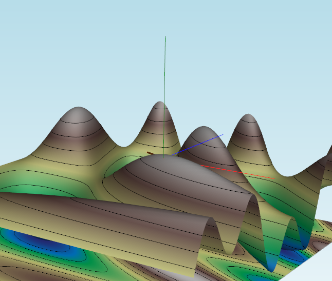

# Animation and Robotics 2024 - Assignment 1


Student & ID: Bashar Beshoti - 207370248


### Task 1: Understanding the code, via adding the following features to the code; 
1. A callback for a mouse right button press. Choose what will happen and report on it. Be creative.
I've added the following function that triggers when a right click occurs. the function draw the 3d axis from the pressed location. afterwards, I added the callback to the plotters: `plt.add_callback('right click mouse', OnMouseRight)`

```py
# TODO - Draw the X, Y, and Z axes in red, blue, and green respectively upon right-clicking
def OnMouseRight(evt):
    if evt.object is not None:
        # Get the clicked 3D coordinates
        pt = evt.picked3d
        
        # Define the axes endpoints
        axis_length = 1.0
        x_axis_end = pt + [axis_length, 0, 0]
        y_axis_end = pt + [0, axis_length, 0]
        z_axis_end = pt + [0, 0, axis_length]
        
        # Create the X, Y, Z axes lines
        x_axis = vd.Line(pt, x_axis_end, c='red')
        y_axis = vd.Line(pt, y_axis_end, c='blue')
        z_axis = vd.Line(pt, z_axis_end, c='green')
        
        # Add the axes to the plot
        plt.add(x_axis)
        plt.add(y_axis)
        plt.add(z_axis)

        plt.render()
        #after importing time library
        time.sleep(1.0)

        plt.remove(x_axis)
        plt.remove(y_axis)
        plt.remove(z_axis)   

```

__Image 1:__



__Image 2:__


2. Adding a graph of the function values on the path (the numpy array Xi) such that the graph should sync update as the path extends Using `vedo.plot` and report what happened.Then, then using `vedo.plot.clone2d` to fix it.

As it is mentioned above, To create a graph that updates sync upon path extending. There is a need to remove the old version with each rendered frame consistiously, preventing a double plots appear on the spot.
```py
# TODO - Update the function graph with the new path
def update_function_graph():
    global function_graph,old_graph
    if len(Xi) >= 1:
        if old_graph:
            plt.remove(old_graph)
        # x_values = np.arange(len(Xi))
        # 3D PROJECTION
        function_graph = plot(function_values, title="Function Values on Path", xlabel="Points", ylabel="Gradient Step Value", c='red') 
        # 2D PROJECTION 
        function_graph = function_graph.clone2d() 
        old_graph = function_graph
        plt.add(old_graph)
    else:
        function_graph = None
```
1. Without clone2d:
Image 1 :

Image 2 :


The plot is created in a 3d model object therefore resulting in a graph updates in realtime within path extends projected in the three main axis (x,y,z).

2. With clone2d:
GIF : 


Through `clone2d()` call to the function, it shifts the graph from 3d to 2d plane projection which is a transformation that converts the 3D surface into a 2D representation as XY plane.

<!-- pagebreak -->

### Task 2: Optimize
The code includes rudimentary optimization functions.
1. Change the code such that the mouse does not cause a path to form anymore. Do not remove the path code yet, as it will be used to plot the progression of the optimization. <font color="green">✓</font>

2. Add a left mouse button click callback that, when clicked on the surface or the plane under it, clears the path and sets the current optimization candidate to that position.<font color="green">✓</font>

```py
def OnMouseLeft(evt):
    global Xi, objective_values, selected_point, Xi_gradient, Xi_newton, DoubleGraphVisiblie,old_graph, function_graph
    if evt.actor and evt.picked3d is None:
        return
    
    reset()
    pt = evt.picked3d
    X = np.array([pt[0], pt[1], objective([pt[0], pt[1]])])
    Xi = np.append(Xi, [X], axis=0)
    Xi_gradient = np.append(Xi_gradient, [X], axis=0)
    Xi_newton = np.append(Xi_newton, [X], axis=0)
    if len(Xi) > 1:               # need at least two points to compute a distance
        txt = (
        f"X:  {vd.precision(X,2)}\n"
        f"dX: {vd.precision(Xi[-1,0:2] - Xi[-2,0:2],2)}\n"
        f"dE: {vd.precision(Xi[-1,2] - Xi[-2,2],2)}\n"
            )
    else:
        txt = f"X: {vd.precision(X,2)}"    
    msg.text(txt)
    selected_point = np.array([pt[0], pt[1]])
    objective_values.append(objective(selected_point))
    newton.append(objective(selected_point))
    gradient_descent.append(objective(selected_point))
    print(f"Selected point: {selected_point}")
    plt.add(vd.Point(selected_point,r=8, c="blue"))
    plt.add(vd.Point(pt,r=8, c="blue"))
    plt.render() 
```        

3. Add a button that runs a single gradient descent step and updates the path (the last point in the path should be the last candidate)
Adding Button To The Plotter that triggers a `GradientDescentStep` function upon clicking. <font color="green">✓</font>

The Button :
```py
# TODO - Adding a Gradient Descent Step button
GradientDescentButton = plt.add_button(GradientDescentStep,
    pos=(0.1, 0.5),   # x,y fraction from bottom left corner
    states=["Gradient Descent"],
    c="w",     # font color for each state
    bc="dg"  # background color for each state
)
```
`GradientDescentStep` Function : 

```py
def GradientDescentStep(obj, ename):
    global Xi, objective_values, DoubleGraphVisiblie, selected_point
    temp = selected_point
    # If no point is selected, return
    if len(Xi) < 1 or selected_point is None:
        print("Please select a point on the surface first")
        return
    
    # If a point is selected, run a single gradient descent step
    selected_point = Xi[-1][:2]
    X = optimize(objective, selected_point, gradient_direction, tol=1e-6, iter_max=1)
    value = objective([X[0], X[1]])
    Xi = np.append(Xi, [[X[0], X[1], value]], axis=0)
    objective_values.append(value)
    # adding a visual arrow to show the step
    plt.add(vd.Arrow(Xi[-2,:], Xi[-1,:], s = 0.001, c='green'))
    # selected_point = Xi[-1][:2]
    update_function_graph()
    DoubleGraphVisiblie = False
    selected_point = temp

```

4. Add a button that runs a single Newton's step.
Adding Button To The Plotter that triggers a `NewtonsStep` function upon clicking. <font color="green">✓</font>

The Button :
```py
# TODO - Adding a Newton Step button
NewtonButton = plt.add_button(NewtonsStep,
    pos=(0.1, 0.57),   # x,y fraction from bottom left corner
    states=["Newton's Step"],
    c="w",     # font color for each state
    bc="dg"  # background color for each state
)
```


`NewtonsStep` Function : 

```py
def NewtonsStep(obj, ename):
    global Xi, objective_values, DoubleGraphVisiblie, selected_point
    temp = selected_point
    # If no point is selected, return
    if len(Xi) < 1 or selected_point is None:
        print("Please select a point on the surface first")
        return
    
    # If a point is selected, run a single gradient descent step
    selected_point = Xi[-1][:2]
    X = optimize(objective, selected_point, Newton_direction, tol=1e-6, iter_max=1)
    value = objective([X[0], X[1]])
    Xi = np.append(Xi, [[X[0], X[1], value]], axis=0)
    objective_values.append(value)
    print(objective_values)
    # adding a visual arrow to show the step
    # create if statment that checks if the new point is not outside the surface
    if value < objective(selected_point):
        plt.add(vd.Arrow(Xi[-2,:], Xi[-1,:], s = 0.001, c='green')).render()
    else:
        plt.remove(vd.Arrow(Xi[-2,:], Xi[-1,:], s = 0.001, c='green'))
    plt.add(vd.Arrow(Xi[-2,:], Xi[-1,:], s = 0.001, c='green')).render()
    # selected_point = Xi[-1][:2]
    update_function_graph()
    DoubleGraphVisiblie = False
    selected_point = temp

```


5. Don't forget the graph from the previous task. It should still be visible and show the values of the objective along the path. Attach a few pictures to the report and explain what they show.

- __Gradient Descent:__


- __Explaination:__
After Running the code, i chose `Selected_point = (0.54, 2.0, 0.9)` which display on screen with two blue dots. one on the selected plot and other is on the plot in z=0 the lower "plot". after few clicks on the `GradientDescentButton`. it reached to an end point where he found the minimum nearby through __Gradient Descent Approach__. 

GIF :


- __Newton Approach:__


- __Explaination:__

After performing the code with `Selected_point = (0.57, 2.1, 0.85)` in the picture 2 which display on screen with two blue dots. one on the selected plot and other is on the plot in z=0 the lower "plot". after few clicks on the `NewtonButton`. it reached to an end point where he found the minimum nearby through __Newton Approach__.However. it's not always functioning as supposed to be and that is due to non-positive value of f(x)'' leads to inaccuracy and sometimes to bugs. but i managed with an additional if statment to reduce it's occurance.

GIF:


### Task 3: Evaluate
We regularly need to know which method performs better. To test this, we need to compare methods in terms of speed and convergence rate.

1. Change the code such that is maintains two paths, one for gradient descent steps and one for Newton steps. when pressing with the gradient or Newton's button, it will only advance the appropriate one. In addition, the plot of the objective should present both paths. <font color="green">✓</font>
Spliting Into Two Methods : 


</br>

An inialized `DoubleGraphVisiblie = False` boolean variable that is set true only if it is clicked on __Activate Gradient Descent and Newton's Step__ Button. When it is changed to true, the function `BothStep` take action of computation over Gradient & Newton Step together along to the current path after it is continiously conducted through __Left Mouse Press__. Eventually, creating a plot with two graphs in plot; <font color="red"><b>Gradient Step</b></font> and <font color="blue"><b>Newton Step</b></font>


```py
# TODO - Adding a Gradient Descent and Newton's Step button
BothButton = plt.add_button(BothStep,
    pos=(0.5, 0.9),   # x,y fraction from bottom left corner
    states=["Activate Gradient Descent and Newton's Step"],
    c="w",     # font color for each state
    bc="dg"  # background color for each state
)
```

whereas `BothStep` & `update_Double_graph` function is :
```py
# 5. Add a button to run a single Gradient Descet & Newton's step
def BothStep(obj, ename):
    global Xi_gradient,Xi_newton, gradient_descent,newton, DoubleGraphVisiblie, selected_point
    # If no point is selected, return
    if len(Xi) < 1 or selected_point is None:
        print("Please select a point on the surface first")
        return
    DoubleGraphVisiblie = True
    # If a point is selected, run a single gradient descent step    
    X_gradient = optimize(objective, Xi_gradient[-1][:2], gradient_direction, tol=1e-6, iter_max=1)
    gradient_value = objective([X_gradient[0], X_gradient[1]])
    gradient_descent.append(gradient_value)
    # if a point is selected, run a single Newton's step
    X_newton = optimize(objective, Xi_newton[-1][:2], Newton_direction, tol=1e-6, iter_max=1)
    Newton_value = objective([X_newton[0], X_newton[1]])
    newton.append(Newton_value)
    print(f"Gradient Descent: {gradient_value}, Newton's Step: {Newton_value}")

    Xi_gradient = np.append(Xi_gradient, [[X_gradient[0], X_gradient[1], gradient_value]], axis=0)
    Xi_newton = np.append(Xi_newton, [[X_newton[0], X_newton[1], Newton_value]], axis=0)

    # adding a visual arrow to show the step
    plt.add(vd.Arrow(Xi_gradient[-2,:], Xi_gradient[-1,:], s = 0.001, c='red'))
    plt.add(vd.Arrow(Xi_newton[-2,:], Xi_newton[-1,:], s = 0.001, c='blue'))
    update_Double_graph()

def update_Double_graph():
    
    global function_graph, old_graph, BothGraph, newton, gradient_descent
    if DoubleGraphVisiblie is False:
        return
    
    if len(Xi) >= 1:
        if old_graph:
            plt.remove(old_graph)

        BothGraph = plot(gradient_descent, xlabel="Points", ylabel="Objective Value", c='red')
        BothGraph += plot(newton, xlabel="Points", ylabel="Objective Value", c='blue', like=BothGraph)


        BothGraph = BothGraph.clone2d()
        old_graph = BothGraph
        
        plt.add(old_graph).render()
    else:
        BothGraph = None


```

2. Select several points, and plot the value of the objective after enough iterations are performed such that the is no visible difference between iterations. Put the results in your report. 


3. (Optional) How many iterations are needed? Devise an automatic way to decide when to stop iterating and report on your approach.


4. (Optional) The gradients and Hessians in the code are computed numerically using finite differences. This is a slow but simple way to obtain them. The alternative is to compute them analytically by hand, using basic calculus (or to use automatic differentiation). Write two new functions that compute the gradient and Hessian of the objective analytically and copy the code to your report.


5. (Optional) Measure the time it takes to run the numerical vs. analytical computation.


6. (Optional) The finite different approximation relies on a finite epsilon. Compare the values of the finite difference gradients for different epsilons with the analytical (true) value.